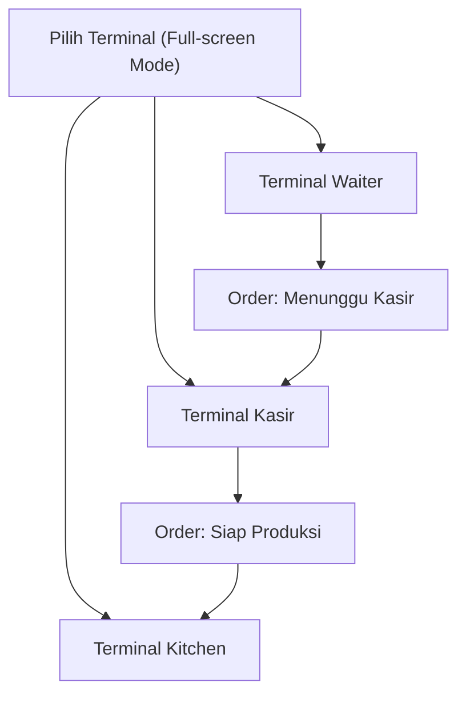

## 1. Product Overview

Mode UI PWA full-screen untuk operasional restoran (waiter/kasir/kitchen) dengan alur gatekeeper waiter→kasir→kitchen.
Mode ini bersifat tambahan (opt-in) dan tidak mengubah/menghapus fitur lama di aplikasi.

## 2. Core Features

### 2.1 User Roles

| Role                   | Registration Method        | Core Permissions                                                                                      |
| ---------------------- | -------------------------- | ----------------------------------------------------------------------------------------------------- |
| Waiter                 | Login staff yang sudah ada | Buat pesanan per meja, simpan draft, kirim ke kasir, lihat status pesanan yang dibuat                 |
| Kasir                  | Login staff yang sudah ada | Review pesanan dari waiter, finalisasi item/qty (jika diizinkan), proses pembayaran, kirim ke kitchen |
| Kitchen                | Login staff yang sudah ada | Terima tiket dari kasir, ubah status masak/siap, tandai selesai                                       |
| Admin/Owner (existing) | Login yang sudah ada       | Mengelola data master & laporan (tetap seperti fitur lama)                                            |

### 2.2 Feature Module

Aplikasi membutuhkan halaman inti berikut untuk menjalankan mode full-screen:

1. **Pilih Terminal (Full-screen Mode)**: masuk mode full-screen, pilih peran (waiter/kasir/kitchen), ganti user cepat.
2. **Terminal Waiter**: pilih meja, tambah item, catatan, simpan draft, kirim ke kasir, pantau status.
3. **Terminal Kasir**: antrian order dari waiter, verifikasi order, pembayaran, cetak/konfirmasi, kirim ke kitchen.
4. **Terminal Kitchen**: antrian tiket, detail item per order, ubah status (masak/siap/selesai), filter/prioritas.

### 2.3 Page Details

| Page Name                         | Module Name                         | Feature description                                                                                                                                          |
| --------------------------------- | ----------------------------------- | ------------------------------------------------------------------------------------------------------------------------------------------------------------ |
| Pilih Terminal (Full-screen Mode) | Masuk full-screen                   | Mengaktifkan tampilan layar penuh (kiosk-like) dan mengunci navigasi ke mode terminal selama sesi aktif.                                                     |
| Pilih Terminal (Full-screen Mode) | Pemilihan peran                     | Memilih peran UI (waiter/kasir/kitchen) untuk membuka terminal yang sesuai.                                                                                  |
| Pilih Terminal (Full-screen Mode) | Gatekeeper info                     | Menjelaskan alur: waiter membuat → kasir menyetujui & bayar → kitchen menerima untuk produksi.                                                               |
| Pilih Terminal (Full-screen Mode) | Ganti user cepat                    | Mengganti akun staff tanpa keluar dari mode full-screen (mis. logout cepat / pin).                                                                           |
| Terminal Waiter                   | Pemilihan meja                      | Menampilkan daftar meja & status (kosong/terisi), memilih meja untuk membuat pesanan.                                                                        |
| Terminal Waiter                   | Penyusunan order                    | Menambah/mengurangi item, jumlah, catatan item/order, dan menyimpan sebagai draft.                                                                           |
| Terminal Waiter                   | Kirim ke kasir (Gatekeeper step 1)  | Mengirim order dari status draft menjadi “Menunggu Kasir” dan mengunci perubahan utama setelah terkirim (kecuali dibuka kembali oleh kasir bila diperlukan). |
| Terminal Waiter                   | Pelacakan status                    | Melihat status order: Menunggu Kasir → Diproses Kasir → Dikirim ke Kitchen → Diproses Kitchen → Selesai.                                                     |
| Terminal Kasir                    | Antrian order waiter                | Menampilkan daftar order “Menunggu Kasir” dengan pencarian/filter (meja, waktu, waiter).                                                                     |
| Terminal Kasir                    | Review & finalisasi                 | Membuka detail order, memverifikasi item/qty/catatan, lalu menandai “Disetujui Kasir”.                                                                       |
| Terminal Kasir                    | Pembayaran (Gatekeeper step 2)      | Mencatat metode bayar & nominal, menandai “Lunas/Siap Produksi”, lalu mengirim tiket ke kitchen.                                                             |
| Terminal Kasir                    | Koreksi & pembatalan terbatas       | Membatalkan/return sesuai aturan aplikasi yang sudah ada (tanpa mengubah kebijakan lama).                                                                    |
| Terminal Kitchen                  | Antrian tiket                       | Menampilkan tiket yang sudah “Siap Produksi” dari kasir dengan urutan waktu/prioritas.                                                                       |
| Terminal Kitchen                  | Detail tiket                        | Menampilkan item, qty, catatan, dan informasi meja untuk produksi.                                                                                           |
| Terminal Kitchen                  | Status produksi (Gatekeeper step 3) | Mengubah status: “Mulai Masak” → “Siap” → “Selesai”, dengan timestamp.                                                                                       |
| Terminal Kitchen                  | Filter tampilan                     | Memfilter tiket berdasarkan status (baru/dimasak/siap) agar operasional cepat.                                                                               |

## 3. Core Process

**Waiter Flow**: pilih meja → susun pesanan (item/qty/catatan) → simpan draft bila perlu → kirim ke kasir → pantau status sampai selesai.

**Kasir Flow**: buka antrian “Menunggu Kasir” → review detail → setujui → proses pembayaran → setelah lunas kirim ke kitchen.

**Kitchen Flow**: terima tiket “Siap Produksi” → mulai masak → tandai siap → tandai selesai.

