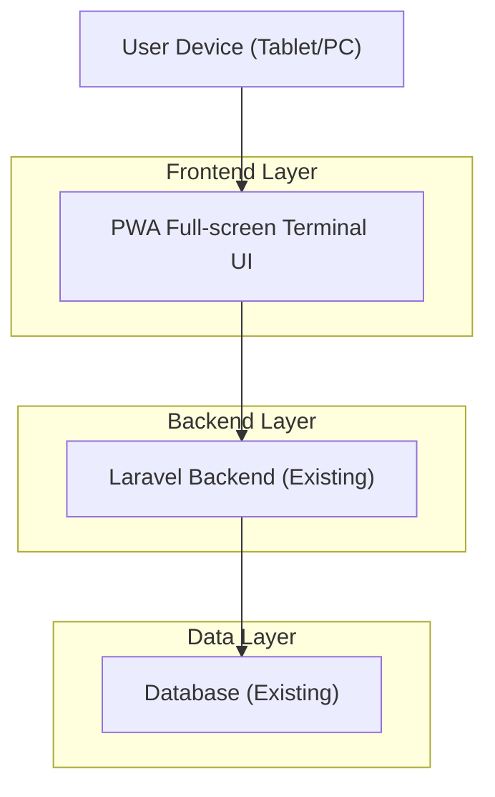
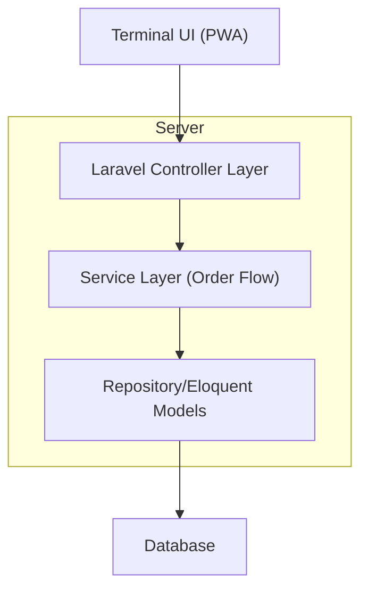
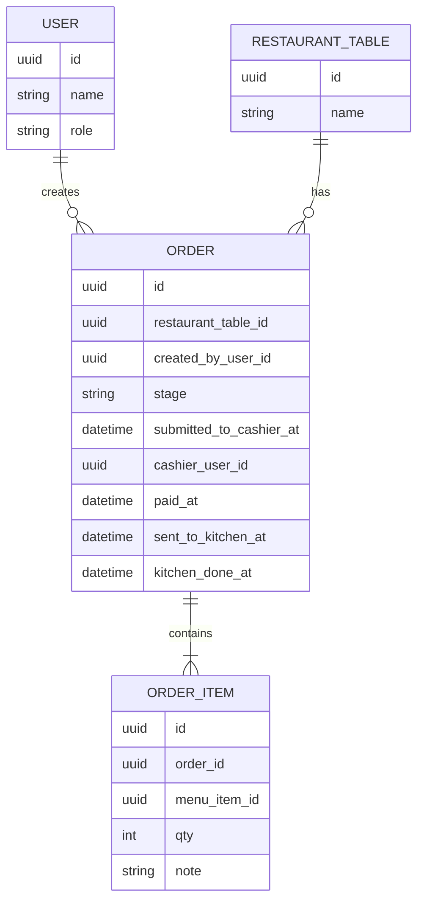

## 1.Architecture design


## 2.Technology Description
- Frontend: React@18 + vite + tailwindcss@3 (dibangun sebagai mode/route baru; tidak menghapus Blade/fitur lama)
- Backend: Laravel (existing)
- Database: Existing DB via Laravel Eloquent (tetap)

## 3.Route definitions
| Route | Purpose |
|-------|---------|
| /login | Login staff (existing) untuk akses mode terminal |
| /terminal | Halaman pilih peran + masuk full-screen |
| /terminal/waiter | UI full-screen untuk waiter |
| /terminal/kasir | UI full-screen untuk kasir |
| /terminal/kitchen | UI full-screen untuk kitchen |

## 4.API definitions
### 4.1 Core Types (TypeScript shared)
```ts
export type TerminalRole = "waiter" | "kasir" | "kitchen";

export type OrderStage =
  | "DRAFT"
  | "WAITING_CASHIER"
  | "CASHIER_APPROVED"
  | "READY_FOR_KITCHEN"
  | "COOKING"
  | "READY"
  | "DONE";

export type OrderItemInput = {
  menuItemId: string;
  qty: number;
  note?: string;
};

export type PaymentInput = {
  method: "cash" | "qris" | "card" | "other";
  amountPaid: number;
};
```

### 4.2 Core API
Create/update draft order (waiter)
```
POST /api/terminal/orders
PATCH /api/terminal/orders/{orderId}
```

Submit to cashier (gatekeeper step 1)
```
POST /api/terminal/orders/{orderId}/submit-to-cashier
```

Approve + pay (gatekeeper step 2)
```
POST /api/terminal/orders/{orderId}/approve-and-pay
```

Kitchen status update (gatekeeper step 3)
```
POST /api/terminal/orders/{orderId}/kitchen-status
```

## 5.Server architecture diagram


## 6.Data model(if applicable)
### 6.1 Data model definition


### 6.2 Data Definition Language
Catatan: ini bersifat penambahan kolom/logika untuk mendukung gatekeeper, tanpa menghapus struktur/fitur lama.

Order stage & audit minimal
```
-- recommended: add columns (adapt to existing schema)
ALTER TABLE orders ADD COLUMN stage VARCHAR(32) DEFAULT 'DRAFT';
ALTER TABLE orders ADD COLUMN submitted_to_cashier_at TIMESTAMP NULL;
ALTER TABLE orders ADD COLUMN cashier_user_id UUID NULL;
ALTER TABLE orders ADD COLUMN paid_at TIMESTAMP NULL;
ALTER TABLE orders ADD COLUMN sent_to_kitchen_at TIMESTAMP NULL;
ALTER TABLE orders ADD COLUMN kitchen_done_at TIMESTAMP NULL;

CREATE INDEX idx_orders_stage ON orders(stage);
CREATE INDEX idx_orders_submitted_to_cashier_at ON orders(submitted_to_cashier_at);
```
